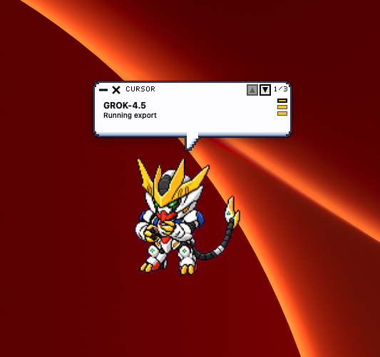
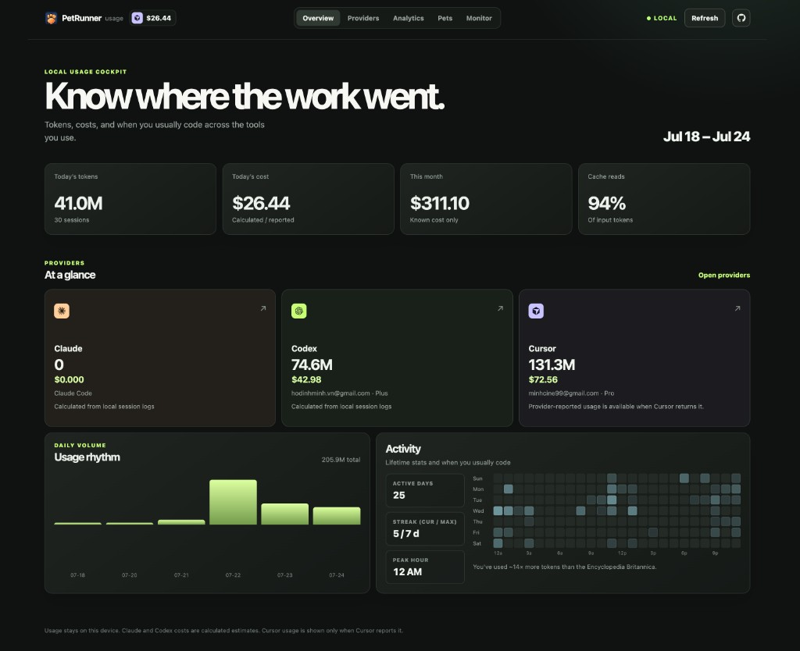
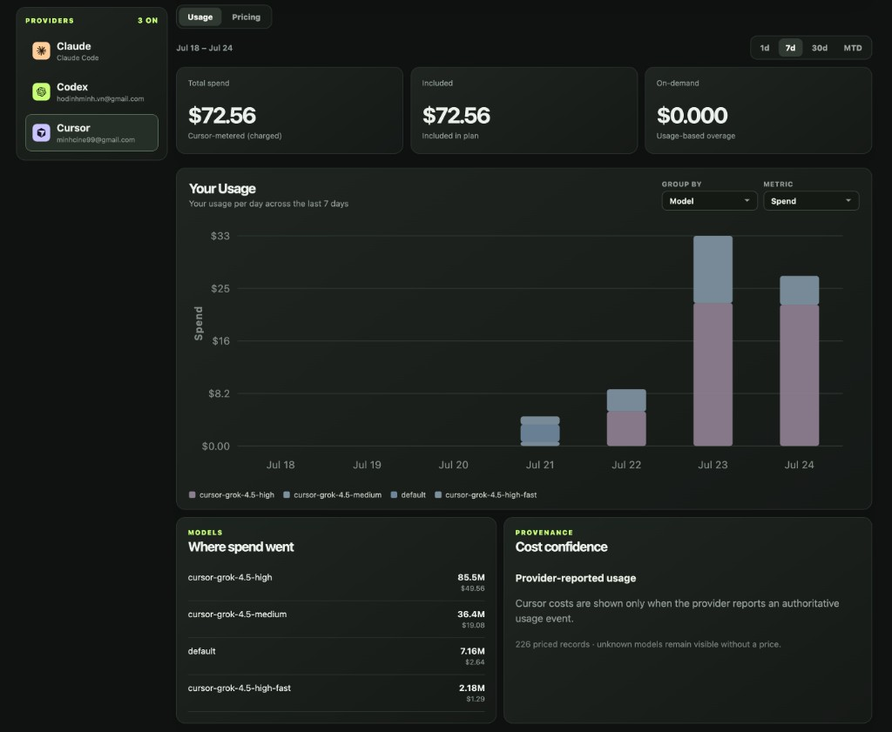
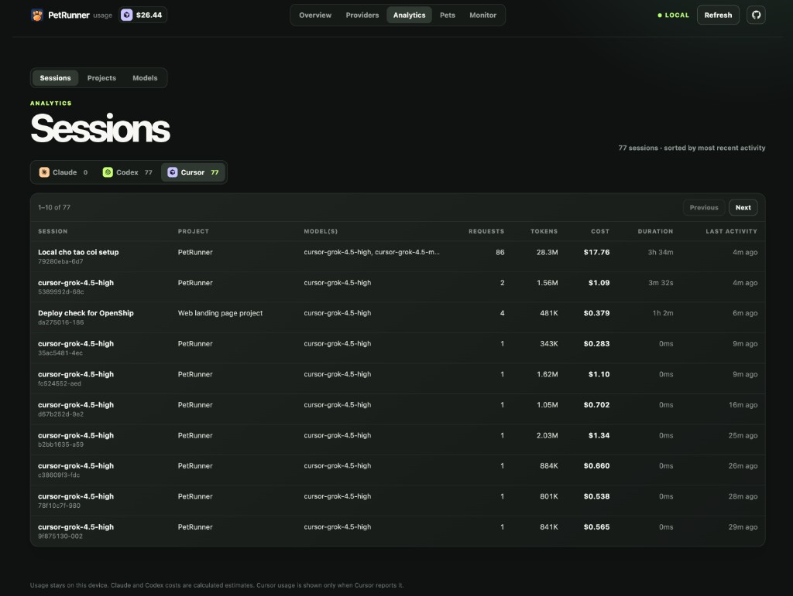
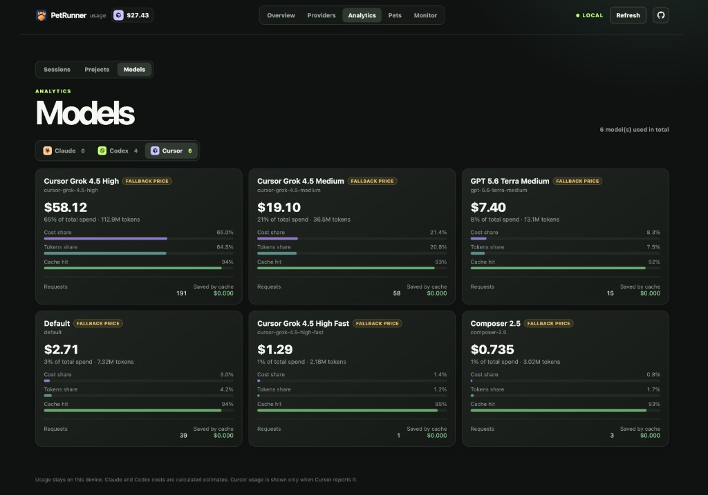
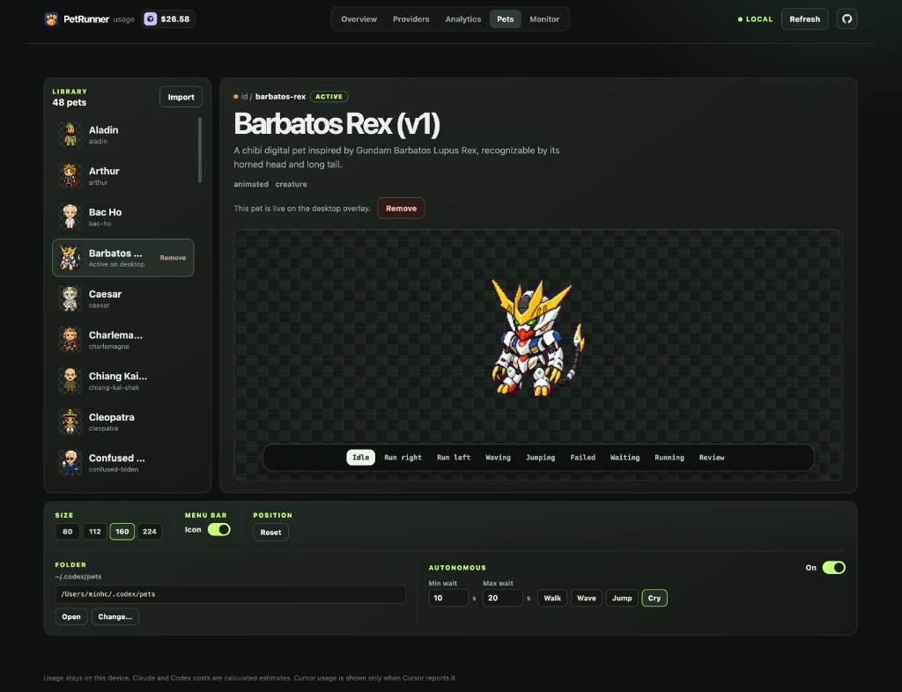
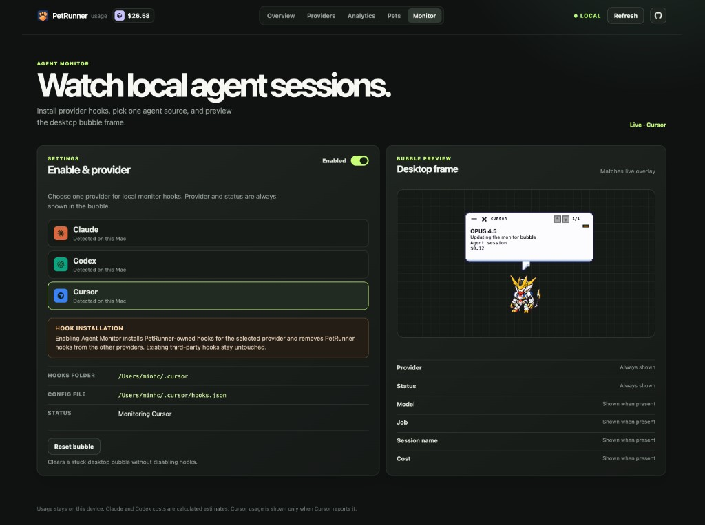

# PetRunner

Local desktop pet runner and usage dashboard for Codex-compatible custom pets.
It reads `${CODEX_HOME:-~/.codex}/pets` and never starts, embeds, or connects to
Codex.

<p align="center">
  
</p>

Source: [github.com/hdminh/PetRunner](https://github.com/hdminh/PetRunner)

## Install and start

```bash
npx @hdminh/pet-runner start
```

On a TTY, the CLI asks for pets directory, which pet to show, Agent Monitor
(macOS), which providers feed Usage/Analytics, autonomy, and menu bar
visibility before building. Use `--yes` to skip the wizard, `--setup` to run
it again, or `npx @hdminh/pet-runner setup` on its own.

On first use, the CLI checks the platform toolchain and builds PetRunner locally.
Later runs open the installed build immediately—no repository clone required.

```bash
npx @hdminh/pet-runner install
npx @hdminh/pet-runner update
npx @hdminh/pet-runner uninstall
```

Requirements:

- macOS 14+ with Xcode Command Line Tools
- Windows 10/11 x64 with the .NET 10 SDK

Override the pet library:

```bash
npx @hdminh/pet-runner start --pets-dir /absolute/path/to/pets
```

See [docs/RUN_LOCAL.md](docs/RUN_LOCAL.md) for prerequisites, the manual
source-build fallback, Agent Monitor details, and troubleshooting.

## Pets

Default library: `${CODEX_HOME:-~/.codex}/pets`.

On first launch PetRunner seeds the bundled **maomao** pet when that package is
missing and prefers it when nothing else is selected.

- Download more pets from [pet-runner.com](https://pet-runner.com)
- Import a ZIP (or folder) from the **Pets** tab
- Or install with Petdex / `npx codex-pets add <id>`

Drag the pet to move it, throw it toward a screen edge, hover or click to jump,
or drag the lower-right handle to resize. Use the menu-bar / tray paw to reload
pets, change size, or quit.

## Dashboard

Open the Dashboard from the menu bar / tray icon, Applications, or the pet’s
context menu. Usage indexes local Claude / Codex / Cursor session data on this
device only.

When Agent Monitor is enabled, the top bar shows today’s spend for the active
Monitor provider.

### Overview

KPIs for today’s tokens and cost, month-to-date spend, provider cards, daily
volume, and an activity heatmap of when you usually work.



### Providers

Per-provider **Usage** and **Pricing** panels, spend charts, model breakdowns,
and daily / monthly budgets.



### Analytics

**Sessions**, **Projects**, and **Models**—filter by Claude, Codex, or Cursor.





### Pets

Installed library, animation preview, size / menu-bar / folder settings, and
optional autonomous motion.



### Monitor

Enable Agent Monitor for Claude Code, Codex, or Cursor; preview the desktop
bubble; reset live session state. Activity labels are derived locally from
lifecycle hooks—PetRunner never sends them to an LLM.



## Privacy

Usage stays on this device. Claude and Codex costs are calculated estimates;
Cursor usage appears only when Cursor reports it. Agent Monitor never retains
or displays prompts, tool output, full commands, raw payloads, or transcripts.

## Local development

From a clone of this repository:

```bash
# macOS
./script/build_and_run.sh
swift test

# Windows
.\script\build_and_run.ps1
dotnet run --project windows\PetRunner.Tests\PetRunner.Tests.csproj
```

`./script/build_and_run.sh` stages `dist/PetRunner.app` and opens it. Full
platform notes (including MSIX packaging) are in
[docs/RUN_LOCAL.md](docs/RUN_LOCAL.md).

## Publishing packages

GitHub Releases run `.github/workflows/publish-packages.yml` (npm + GitHub
Packages). Package versions are immutable after publish; bump before any
follow-up release. Do not publish unless explicitly intended.

## License

PetRunner is available under the [MIT License](LICENSE).
