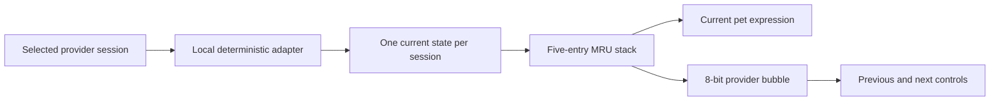
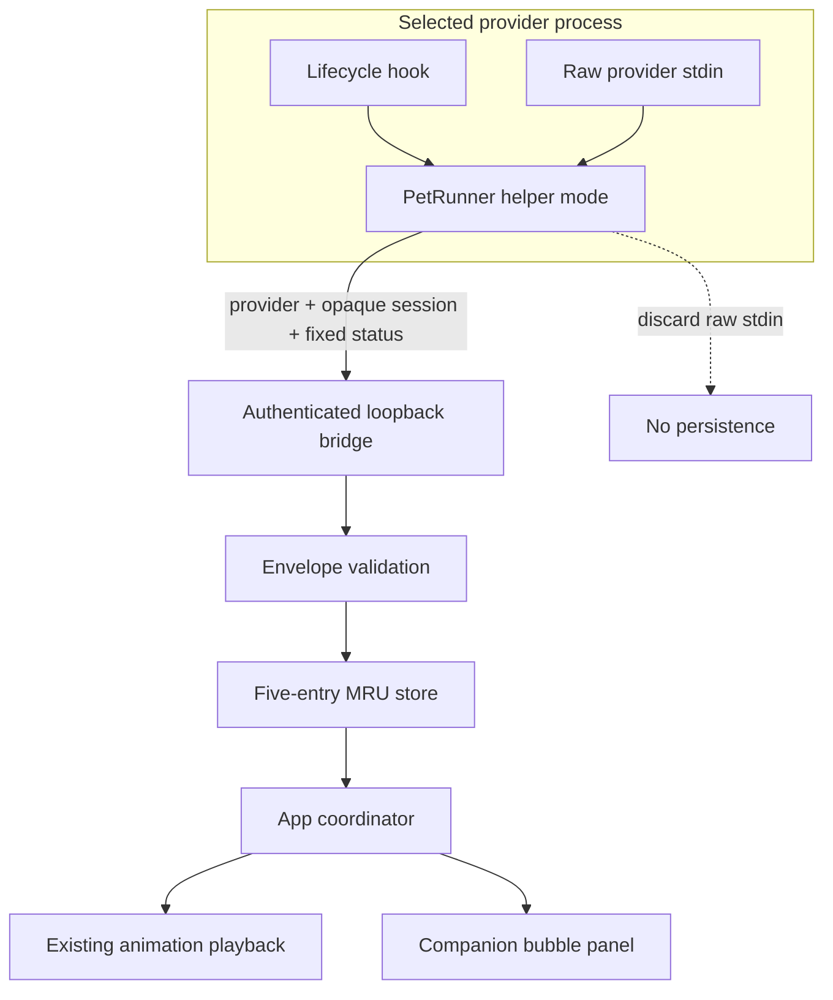
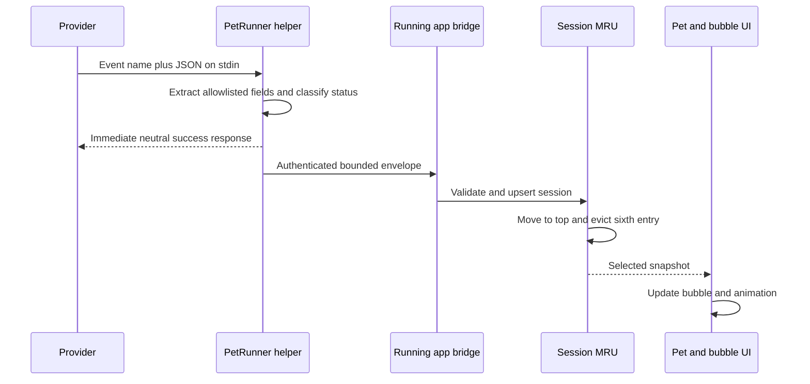
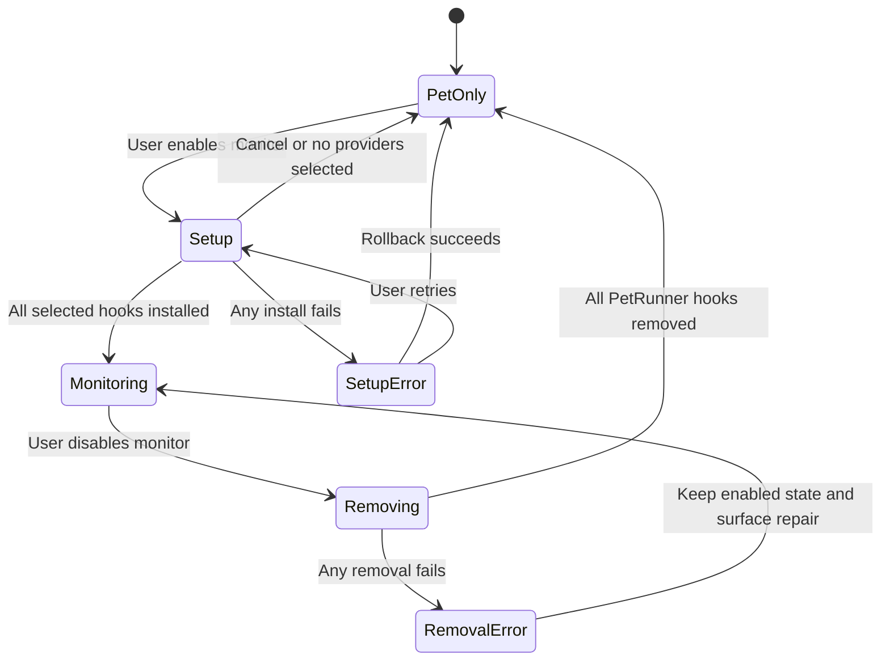
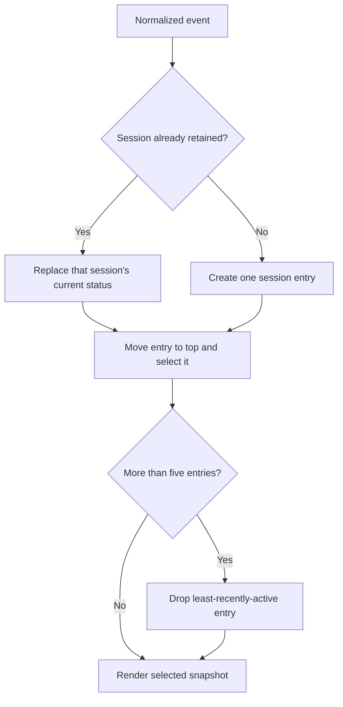

# Agent Session Monitor - Plan

## Goal Capsule

- **Objective:** Let a macOS PetRunner user understand an agent task's broad progress, approval need, completion, or failure from the floating pet while they are working elsewhere.
- **Product authority:** The Product Contract governs user-visible behavior; the Planning Contract governs implementation choices; provider limitations must be surfaced rather than hidden with guessed states.
- **Execution profile:** Deep, macOS-first feature spanning deterministic hook adapters, local IPC, AppKit UI, user configuration, packaging, and uninstall cleanup.
- **Stop conditions:** Never overwrite an unreadable provider config, never leave a selected provider partially installed without reporting it, and never forward prompt, command, filename, transcript, or tool payload content beyond the hook helper.
- **Tail ownership:** The implementation owns focused Swift and npm coverage, provider-fixture checks, manual macOS UI validation, documentation, and removal of abandoned experimental code.
- **Open blockers:** None.

---

## Product Contract

### Summary

PetRunner will add an opt-in macOS agent-session monitor. Selected coding-agent providers drive a single pet's expression and a bounded stack of up to five active-session bubbles, ordered by most recent activity.

### Problem Frame

Developers often run Claude Code, Codex, or Cursor while focused in another tab or application. They cannot continuously watch every agent session, yet need to notice broad state changes such as work in progress, an approval request, completion, or failure. Existing activity signals should not expose prompts, commands, filenames, or other session content during screen sharing.

### Key Decisions

- **Use a provider-neutral local adapter.** Each selected provider contributes lifecycle events to one local monitor contract, keeping the pet UI independent from provider-specific hook formats and allowing multi-provider selection.
- **Show one pet, not one pet per session.** The pet represents the most recently active session, while up to four other active sessions remain available in a navigable bubble stack.
- **Keep one current bubble per session.** A new event updates the session's existing bubble and moves it to the top; PetRunner does not retain an event-by-event bubble history.
- **Use fixed status text only.** Bubbles express a small status vocabulary rather than tool inputs or transcript excerpts, preserving privacy and avoiding any model call or token usage from the monitor.
- **Treat monitoring as a separate opt-in feature.** A user may use PetRunner purely as a decorative pet. Disabling monitoring removes its provider hooks; re-enabling requires a fresh setup choice.

### Actors

- A1. A developer who wants ambient awareness of coding-agent work while using other applications.
- A2. A selected provider: Claude Code, Codex, or Cursor.
- A3. PetRunner, which receives normalized session activity and renders the pet and active-session bubble stack.

### Requirements

**Monitoring and privacy**

- R1. PetRunner must offer an opt-in monitor mode on macOS without changing the normal pet-only experience when the mode is off.
- R2. Monitor mode must represent the fixed bubble texts `Working…`, `Reviewing…`, `Needs approval`, `Finished`, and `Failed` through both the current pet expression and a bubble.
- R3. Bubbles must use an 8-bit visual treatment and show the originating provider as a short visible label, such as `CODEX`, `CLAUDE`, or `CURSOR`.
- R4. Bubble text must not include prompts, filenames, commands, search terms, tool payloads, or transcript content.
- R5. The monitor must not invoke an LLM or make a model request to derive status text.

**Active-session stack**

- R6. PetRunner must identify provider sessions and maintain one current bubble for each session retained in the current runtime stack, with a hard maximum of five entries.
- R7. A new event must update that session's existing bubble, move it to the top, select it as the current pet state, and never append an event-history bubble.
- R8. The user must be able to navigate backward and forward through the bounded active-session stack; a sixth newly active session evicts the least-recently-active entry.

**Setup and lifecycle**

- R9. When the user enables monitoring, setup must detect available supported providers and suggest them without preselecting any provider.
- R10. Setup must allow the user to choose one or more of Claude Code, Codex, and Cursor in a single run.
- R11. Provider setup must install only the hooks the user selected and preserve unrelated user configuration.
- R12. Disabling monitoring must remove the hooks PetRunner installed; enabling it again must require the user to select and set up providers again.

### Key Flows

- F1. Enable monitoring
  - **Trigger:** A pet-only user turns on monitor mode.
  - **Actors:** A1, A2, A3.
  - **Steps:** PetRunner detects installed providers, presents them as unchecked suggestions, and installs hooks only for the providers A1 selects.
  - **Outcome:** Selected providers can update the monitor; unselected providers leave no monitor hook behind.
- F2. Receive session activity
  - **Trigger:** A selected provider reports lifecycle activity for a session.
  - **Actors:** A2, A3.
  - **Steps:** The local adapter normalizes the event, updates that session's sole bubble, moves it to the top, and enforces the five-session limit.
  - **Outcome:** The pet expression and top bubble communicate the most recently active session's current status and provider without creating event history.
- F3. Review another active session
  - **Trigger:** A1 wants to inspect a bubble hidden beneath the current one.
  - **Actors:** A1, A3.
  - **Steps:** A1 uses the bubble navigation controls to move through the current bounded stack.
  - **Outcome:** A1 can view another active session's latest generic status without interrupting monitoring.
- F4. Disable monitoring
  - **Trigger:** A1 chooses pet-only mode.
  - **Actors:** A1, A2, A3.
  - **Steps:** PetRunner removes the monitor hooks it installed and clears its selected-provider setup state.
  - **Outcome:** The pet remains available, but providers no longer create monitor events or bubbles.

### Acceptance Examples

- AE1. When monitor mode is disabled, PetRunner behaves as a normal decorative pet and no selected-provider PetRunner hook is active.
- AE2. When an enabled provider emits an explicit permission-waiting signal, the pet shows its approval-needed expression and the top bubble reads `Needs approval` with that provider's label.
- AE3. When a previously observed session emits a new event, its existing bubble is updated and becomes the top entry rather than creating another bubble.
- AE4. When a user navigates to another active session, the display contains only that session's latest generic status and provider label.
- AE5. When setup detects Claude Code, Codex, and Cursor, the user may choose any subset, including exactly one provider.
- AE6. When five sessions are already retained and a sixth session emits its first event, the least-recently-active entry is evicted and the stack remains at five.

### Success Criteria

- A user can distinguish active work, review, approval need when the provider exposes it, completion, and failure without switching to the provider's tab.
- The monitor's visible and transported output is safe for routine screen sharing because it contains no task or tool content.
- A user can remain in pet-only mode without PetRunner hook processes running.
- Multiple providers can coexist without duplicating sessions, exceeding five bubbles, or replacing unrelated hooks.

### Scope Boundaries

**Deferred for later**

- A settings surface for adding, removing, and editing pets; choosing bubble colors; and managing enabled providers after initial setup.
- Pet discovery, search, and installation from Petdex, Codex Pets, and other compatible sources.
- Windows support.

**Deferred to follow-up work**

- Process-liveness recovery, stale-session timers, persisted session dashboards, and restart recovery for sessions already in flight.
- Remote, SSH, WSL, cloud-agent, or mobile session bridging.
- Provider-specific interactive approval actions inside PetRunner; v1 observes status only and never approves or denies work.

**Outside v1**

- Native macOS notifications for monitor state changes.
- Detailed tool, prompt, command, file, transcript, project name, or session-title display.
- One pet per session.
- Event-by-event bubble history or persisted session history.

### Dependencies and Assumptions

- Claude Code, Codex, and Cursor expose user-level lifecycle hooks in the installed versions a user selects.
- PetRunner is running locally when selected provider hooks emit events; hook delivery is a silent no-op when it is not running.
- In v1, an active session means an entry retained in the current in-memory MRU stack. A `Finished` or `Failed` entry remains visible until eviction, monitor disablement, or app relaunch so the user can observe the terminal state.
- `Finished` means the provider reported a successful stop or session end; deterministic hooks cannot prove semantic completion of the user's larger project.
- Cursor does not document a passive permission-request lifecycle event equivalent to Claude Code and Codex. PetRunner must not fabricate `Needs approval` for Cursor when no explicit compatible signal exists.
- Only local hook-capable Codex sessions are in scope; Codex cloud sessions are not inferred from local files or APIs.

### Sources and Research

- [Petdex repository](https://github.com/crafter-station/petdex/) provides prior art for provider registries, bounded hook hot paths, local sidecars, config backup, idempotent merge, and ownership-based removal.
- [Clawd on Desk repository](https://github.com/rullerzhou-afk/clawd-on-desk) provides prior art for multi-provider capability gaps, Cursor's neutral hook response requirement, session lifecycle cleanup, and state-only integrations. Its AGPL-3.0 code is a conceptual reference only and must not be copied.
- [Claude Code hooks guide](https://code.claude.com/docs/en/hooks-guide) documents user settings, lifecycle events, command-hook behavior, and the distinction between local command hooks and model-backed prompt or agent hooks.
- [Codex hooks documentation](https://developers.openai.com/codex/hooks) documents user hook locations, trust review, lifecycle events, stdin session identifiers, and concurrent matching hooks.
- [Cursor hooks documentation](https://cursor.com/docs/hooks) documents user-level hooks, session and conversation identifiers, tool lifecycle events, stop status, and required hook response shapes.
- [Cursor CLI lifecycle changelog](https://cursor.com/changelog/cli-jan-16-2026) confirms CLI session start/end, prompt, and stop hook support.

---

## Planning Contract

**Product Contract preservation:** changed R6-R8, F2-F3, AE3-AE4, and added AE6 to capture the confirmed current-state-only, five-session MRU behavior; all other product decisions remain unchanged.

### Key Technical Decisions

- KTD1. **Keep the monitor domain in `PetRunnerCore`.** Model provider, session key, fixed status, animation mapping, selected index, and a five-entry MRU store as Foundation-only types so ordering and privacy behavior are deterministic and unit-testable.
- KTD2. **Normalize inside the short-lived hook helper.** Provider payload parsers may inspect only the event name, stable session identifier, tool category needed to distinguish review from work, and terminal success or failure. The envelope sent to the app contains only provider, opaque session ID, fixed status, and protocol version.
- KTD3. **Reuse the installed PetRunner executable as the hook command.** `main.swift` branches into a hidden helper mode before creating `NSApplication`; this avoids requiring Node, Python, shell utilities, or a separately installed helper on the hook hot path.
- KTD4. **Use an authenticated loopback runtime bridge.** The running app publishes a private runtime descriptor containing an ephemeral loopback endpoint and rotating token. The helper sends one bounded envelope with a short deadline; the app rejects wrong tokens, oversized frames, unknown versions, statuses, or providers.
- KTD5. **Make hook output provider-neutral and non-blocking.** Claude Code and Codex helpers exit successfully without output. Cursor receives its documented neutral JSON response immediately, before best-effort delivery, so monitoring cannot alter permissions, block a tool, or add context to a model turn.
- KTD6. **Own hook entries by an exact PetRunner marker.** Installation is idempotent, keeps a bounded rotation of raw config backups, refuses malformed JSON, preserves array order and unrelated entries, updates stale PetRunner executable paths, and removes only entries carrying the marker. Before commit, compare the source bytes or file identity against the version transformed; if another process changed the config, reread and retry a bounded number of times or abort without writing.
- KTD7. **Render the bubble in a companion panel.** Keep the existing pet `NSPanel`, hit testing, drag physics, and sprite sizing intact; a second nonactivating panel follows the pet frame and renders the selected bubble, stacked-card affordance, and navigation controls.
- KTD8. **Draw the limited text vocabulary with a small bitmap glyph renderer.** The fixed statuses and provider labels fit a code-owned 5x7 glyph set, producing a true pixel treatment without a font dependency, resource-bundle packaging changes, or third-party font license.
- KTD9. **Drive the pet from the selected MRU entry, not state priority.** New activity always selects the most recently active session as requested; browsing temporarily selects another entry, and the next event snaps selection back to the updated top entry.
- KTD10. **Treat setup and teardown as transactions.** Monitor enablement becomes durable only after every selected provider installs successfully. Disablement scans all supported configs for the exact PetRunner marker and clears preferences only after every owned entry is removed; partial failure leaves an actionable error and does not claim pet-only mode.

### Deterministic Status Contract

| Fixed bubble text | Provider evidence | Existing animation | Notes |
|---|---|---|---|
| `Working…` | Prompt/session start or non-read tool start | `.running` | Internal status case is `Working`; remains until another normalized event arrives. |
| `Reviewing…` | Read, search, grep, glob, or equivalent read-only tool start | `.review` | Internal status case is `Reviewing`; tool names are classified in the helper and are never transported. |
| `Needs approval` | Explicit permission request or equivalent waiting event | `.waiting` | Never inferred from command content. Availability depends on provider capability. |
| `Finished` | Successful stop or session end | `.waving` | Means provider lifecycle completion, not semantic project completion. |
| `Failed` | Tool failure, stop failure, or error session end | `.failed` | Error text is discarded. |

### Provider Adapter Contract

| Provider | User config | Session identity | Required event coverage | Known limitation |
|---|---|---|---|---|
| Claude Code | `~/.claude/settings.json` | `session_id` | Prompt/session start, tool start, permission request, stop, failure | `PermissionRequest` is unavailable in some non-interactive modes. |
| Codex | `~/.codex/hooks.json` | `session_id` | Prompt/session start, tool start, permission request, stop, failure | User must review and trust the installed command hook in Codex. |
| Cursor | `~/.cursor/hooks.json` | `conversation_id`, with `session_id` fallback | Session start/end, prompt, tool start/failure, stop | No documented passive permission-request event; return valid neutral JSON for every invocation. |

### High-Level Technical Design

#### Component and privacy boundaries

#### Event delivery sequence

#### Monitor lifecycle

#### MRU update semantics

### Assumptions and Constraints

- The bridge and session stack exist only in memory while PetRunner runs. Relaunch starts with no bubbles even when monitor hooks remain enabled.
- The runtime descriptor contains no session data and is removed on clean termination; a stale descriptor is harmless because the token and endpoint rotate on launch.
- Hook helpers cap stdin and outgoing envelope sizes, use a sub-second deadline, swallow delivery errors, and never log provider payloads.
- MRU recency is the order in which the authenticated bridge accepts valid envelopes. Provider hooks are concurrent, so v1 does not claim a stronger provider-global chronology than local receipt order.
- The macOS account running PetRunner is inside the trust boundary. User-only descriptor permissions and the rotating token isolate other accounts and accidental local senders, but are not a defense against malicious code already running as the same user.
- Detection is advisory: all three provider choices remain unchecked, and a user may select an undetected provider for preconfiguration only after an explicit warning.
- Provider fixtures are sanitized, synthetic payloads committed under tests; real transcripts or user configs must never become fixtures.
- Existing animation rows remain the compatibility contract. No atlas, parsing, physics, CLI argument, or Windows behavior changes are required.
- Exact Swift helper names and the loopback framing primitive may change during implementation, but the authenticated, bounded, no-content transport contract may not.

### System-Wide Impact

- **User configuration:** The feature writes user-owned provider JSON only after explicit selection and must support exact, reversible ownership-based removal.
- **Runtime:** Every monitored event launches a short helper process and performs one loopback write; latency and silent failure behavior affect the provider experience.
- **UI:** A second floating panel must follow pet movement across displays without changing the pet's physics or hit testing.
- **Privacy:** Raw hook inputs briefly enter the helper process but must be reduced before transport and never persisted or displayed.
- **Packaging:** The same executable serves app and helper modes; npm uninstall must remove hooks before deleting the installed app binary that those hooks reference.
- **Cross-platform:** v1 is intentionally macOS-only. Shared pet-format behavior and Windows sources remain untouched.

### Risks and Mitigations

| Risk | Impact | Mitigation |
|---|---|---|
| Provider hook schemas change | A provider stops updating or emits the wrong state | Isolate adapters, keep sanitized fixtures per provider, document supported events, and fail closed on unknown payload versions without touching provider work. |
| Config mutation corrupts or races with user settings | Provider cannot start or loses unrelated hooks | Refuse invalid JSON, back up raw bytes, mutate parsed structures idempotently, compare the source version before atomic replacement, retry bounded conflicts, and test mixed third-party entries plus concurrent edits. |
| Hook helper adds latency or noise | Coding-agent interaction feels slower | Respond to Cursor immediately, use a short delivery deadline, emit no logs or context, and treat a stopped app as success. |
| Another account or accidental local sender spoofs monitor events | Bubble displays false status | Bind loopback only, rotate an unguessable token, store the runtime descriptor with user-only permissions, cap frames, and validate enums; explicitly trust processes already running as the PetRunner user. |
| `Finished` overstates semantic completion | User assumes an entire project is done | Document that it means successful provider stop/session end and never use model inference to strengthen the claim. |
| Cursor cannot expose approval waiting | User expects a status Cursor cannot provide | Show the capability gap in setup help and docs; never infer approval from tool or command content. |
| Bubble clips or jumps across screens | Ambient UI becomes distracting | Keep it in a companion panel, anchor from the current pet frame, clamp as one layout group, and manually test every supported pet size and screen edge. |
| App uninstall leaves dead hook commands | Provider invokes a missing executable | Run ownership-based hook cleanup before deletion and abort destructive uninstall when cleanup reports an unsafe partial failure. |
| Prior-art license contaminates implementation | Project inherits unwanted AGPL obligations | Use Clawd on Desk only for behavioral and architectural comparison; write Swift implementation from this plan and official provider contracts. |

### Alternative Approaches Considered

- **Poll provider logs or transcript directories.** Rejected for v1 because formats are unstable, polling reads more sensitive data than needed, completion is harder to interpret, and the user explicitly chose opt-in hook setup.
- **Run a Node sidecar like broader desktop-pet projects.** Rejected because PetRunner already ships a native executable and the npm installer must not create a second runtime dependency for every hook event.
- **Use highest-priority state across all sessions.** Rejected because the confirmed product behavior is recency: the latest active session moves to the top and owns the pet expression.
- **Persist event history for richer session intelligence.** Rejected because the confirmed scope keeps one current state per session, no event history, and at most five runtime entries.
- **Render the bubble inside the pet panel.** Rejected because enlarging the physics window would couple bubble layout to sprite dragging, screen clamping, resize handles, and pointer hit testing.
- **Bundle a third-party pixel font.** Rejected because a tiny fixed vocabulary can be rendered with owned bitmap glyphs without adding license, packaging, or resource-bundle work.

### Delivery Sequence

1. Establish the deterministic domain and provider config transforms with tests.
2. Add the hidden helper and authenticated bridge, then prove sanitized provider fixtures reach the MRU store.
3. Add transactional setup, provider detection, preferences, and status-menu lifecycle.
4. Add the companion bubble panel and connect selected session status to existing animation playback.
5. Add npm uninstall cleanup, documentation, packaging checks, and end-to-end macOS validation.

---

## Implementation Units

### U1. Monitor domain and bounded active-session store

- **Goal:** Define the privacy-safe provider/status contract and deterministic five-session MRU behavior independently of AppKit and provider files.
- **Requirements:** R2-R8; F2-F3; AE2-AE4, AE6; KTD1, KTD2, KTD9.
- **Dependencies:** None.
- **Files:**
  - Create `Sources/PetRunnerCore/AgentMonitor.swift`.
  - Create `Tests/PetRunnerCoreTests/AgentMonitorTests.swift`.
- **Approach:** Add provider and status enums, an opaque composite session key, a normalized event, a selected-session snapshot, status-to-animation mapping, and an in-memory store that upserts one entry per key. An upsert replaces status, moves the entry to index zero, selects it, and evicts the tail above five. Navigation changes selection without reordering; any subsequent event returns selection to the updated top entry.
- **Execution note:** Implement the MRU and navigation behavior test-first because it is the central product invariant and must not drift while adapters and UI are added.
- **Patterns to follow:** Keep the model Foundation-only like `Sources/PetRunnerCore/Animation.swift`; expose immutable snapshots and explicit mutation methods rather than AppKit callbacks in the core.
- **Test scenarios:**
  1. Insert one event and verify one selected entry with the expected provider, opaque session key, status, and animation.
  2. Covers AE3. Insert two events for one session and verify the count stays one, the status is replaced, and no history entry appears.
  3. Accept sessions A, B, C, then update A and verify bridge-acceptance order A, C, B with A selected.
  4. Covers AE6. Insert six unique sessions and verify exactly five remain and the least-recently-active session is evicted.
  5. Navigate backward and forward across three entries, verify navigation clamps at both ends, and verify only selection changes.
  6. Navigate away from the top, receive a new event for another session, and verify selection snaps to that session at index zero.
  7. Verify every fixed status maps to `.running`, `.review`, `.waiting`, `.waving`, or `.failed` without adding animation rows.
- **Verification:** Core tests demonstrate one-current-state semantics, deterministic MRU ordering, the five-entry cap, navigation, and animation mapping without importing AppKit.

### U2. Provider adapters and reversible hook configuration

- **Goal:** Define provider-specific lifecycle mappings and safe, idempotent JSON transformations for Claude Code, Codex, and Cursor.
- **Requirements:** R4-R5, R9-R12; F1, F4; AE1, AE5; KTD2, KTD5, KTD6.
- **Dependencies:** U1.
- **Files:**
  - Modify `Package.swift` to expose the synthetic fixture directory as a test resource only.
  - Create `Sources/PetRunnerCore/ProviderHookConfiguration.swift`.
  - Create `Tests/PetRunnerCoreTests/ProviderHookConfigurationTests.swift`.
  - Add sanitized fixtures under `Tests/PetRunnerCoreTests/Fixtures/AgentHooks/`.
- **Approach:** Build a provider registry describing detection hints, user config location, event-to-helper arguments, session-ID fields, neutral stdout behavior, and an exact PetRunner marker carried by the owned command signature rather than an undocumented provider-config field. Keep pure functions for install, update, and removal transforms. The transform preserves unknown top-level keys, non-array values it does not own, other commands, and event order; it replaces stale PetRunner commands rather than duplicating them.
- **Execution note:** Characterize provider payloads with sanitized fixtures before connecting filesystem writes or AppKit setup.
- **Patterns to follow:** Follow Petdex and Clawd on Desk conceptually for provider registries, raw-byte backups, exact marker ownership, and atomic JSON replacement; do not copy their AGPL implementation.
- **Test scenarios:**
  1. For each provider, transform an empty object and verify only the required PetRunner events and marker are added.
  2. Apply installation twice and verify byte-equivalent semantic output with no duplicate entries.
  3. Install into a config containing multiple third-party hooks for the same event and verify their order and values remain unchanged.
  4. Change the executable path and verify only stale PetRunner commands are updated.
  5. Remove PetRunner entries and verify unrelated hooks remain; remove now-empty event arrays and the hooks object only when PetRunner made them empty.
  6. Feed malformed JSON, a top-level array, and unexpected hook shapes and verify the transform reports refusal rather than generating replacement content.
  7. Feed provider fixtures containing prompts, commands, file paths, tool payloads, and transcript paths and verify the normalized envelope contains none of those fields.
  8. Verify read/search tool categories normalize to `Reviewing`, other tool starts to `Working`, explicit permission signals to `Needs approval`, successful stop to `Finished`, and failure to `Failed`.
  9. Verify Cursor's adapter requests neutral JSON output while Claude Code and Codex request silent success.
  10. Start from source bytes A, simulate an unrelated writer committing bytes B before PetRunner's replacement, and verify PetRunner rereads/retries against B or aborts without overwriting B.
  11. Generate hook commands for executable paths containing spaces and shell metacharacters, then verify each provider receives the intended literal path and PetRunner ownership marker.
- **Verification:** Fixture and transform tests prove provider compatibility, privacy reduction, idempotency, exact ownership, and reversible removal before any user file is touched.

### U3. Hidden hook helper and authenticated runtime bridge

- **Goal:** Deliver normalized events from provider hook processes to the running macOS app without external runtimes, model calls, or sensitive payload transport.
- **Requirements:** R1-R5, R7, R12; F2, F4; AE1-AE3; KTD3-KTD5.
- **Dependencies:** U1, U2.
- **Files:**
  - Create `Sources/PetRunnerCore/AgentMonitorBridgeContract.swift`.
  - Create `Sources/PetRunner/AgentMonitorBridge.swift`.
  - Modify `Sources/PetRunner/main.swift`.
  - Modify `Sources/PetRunner/AppDelegate.swift`.
  - Create `Tests/PetRunnerCoreTests/AgentMonitorBridgeContractTests.swift`.
- **Approach:** Keep the versioned envelope schema, bounds, and authentication validation in the Core contract so they can be tested without importing AppKit. Branch command-line helper modes before constructing the application. Normal app mode starts a loopback-only listener on an ephemeral endpoint, rotates a random token, writes a minimal user-only runtime descriptor atomically, and removes it on termination. Hook mode caps stdin, uses U2 to extract allowlisted fields, writes the provider's neutral response immediately, reads the descriptor, and sends one versioned envelope with a short deadline. The receiver authenticates before decoding into U1 and dispatches accepted updates to the main actor.
- **Patterns to follow:** Mirror the app's existing `main.swift`/`AppDelegate` split and `OSLog` use, but never log raw hook stdin, session identifiers, or rejected envelope bodies.
- **Test scenarios:**
  1. Encode and decode the smallest valid envelope and verify only protocol version, token, provider, opaque session ID, and status exist.
  2. Reject missing or wrong tokens, unknown providers/statuses, unsupported versions, empty session IDs, trailing frames, and oversized input.
  3. Verify a missing, stale, unreadable, or permission-insecure runtime descriptor produces silent successful helper exit.
  4. Verify malformed provider stdin still returns the provider-required neutral response and sends no event.
  5. Verify the Cursor response is emitted before a simulated slow or unavailable bridge completes.
  6. Verify duplicate valid envelopes update one U1 session rather than creating history.
  7. Integration scenario: start a test listener, invoke helper mode with each sanitized provider fixture, and verify the expected normalized event arrives without fixture content crossing the bridge.
- **Verification:** Contract tests and a process-level fixture smoke check prove local delivery, authentication, bounded parsing, immediate neutral responses, and no dependency on Node, Python, `curl`, or an LLM.

### U4. Opt-in provider setup and monitor lifecycle

- **Goal:** Add explicit enable/setup/disable controls that detect providers, leave every option unchecked, install selected hooks transactionally, and restore pet-only mode safely.
- **Requirements:** R1, R9-R12; F1, F4; AE1, AE5; KTD6, KTD10.
- **Dependencies:** U2, U3.
- **Files:**
  - Create `Sources/PetRunnerCore/ProviderDetection.swift`.
  - Create `Sources/PetRunner/ProviderHookInstaller.swift`.
  - Create `Sources/PetRunner/MonitorSetupWindowController.swift`.
  - Modify `Sources/PetRunner/AppDelegate.swift`.
  - Modify `Sources/PetRunner/StatusMenuController.swift`.
  - Modify `Sources/PetRunner/Preferences.swift`.
  - Create `Tests/PetRunnerCoreTests/ProviderDetectionTests.swift`.
- **Approach:** Put pure detection inputs and supported-provider results in Core, with AppKit/filesystem code supplying macOS installation footprints. Add a status-menu monitor toggle. Enabling activates and fronts an AppKit setup window listing all supported providers with detected/not-detected hints and no initial selection. The filesystem installer rereads the latest config immediately before mutation, keeps a bounded backup rotation with permissions no broader than the source, preserves existing file mode and symlink semantics when the resolved target is a regular user-owned file, and refuses unsupported file types or unsafe targets. Before atomic replacement it verifies the source version has not changed, then retries or aborts on conflict. If a later selected provider fails, rollback removes only PetRunner-owned entries from the latest versions of already-updated configs; raw backups are recovery material, not blind rollback writes. Persist only enabled state and selected provider IDs after success. Disabling scans all supported provider configs and removes exact PetRunner-owned entries while the bridge stays available; only after every removal succeeds does it stop the bridge, clear bubbles, and clear preferences. A partial removal keeps monitoring enabled and reports repair guidance.
- **Patterns to follow:** Reuse `StatusMenuController` callback wiring, `PetRunnerPreferences` accessors, `AppDelegate` orchestration, and non-modal accessory-app behavior.
- **Test scenarios:**
  1. Detect each provider from its supported macOS installation footprint without treating detection as consent.
  2. Covers AE5. Build setup state with all three detected and verify every option remains unchecked and any subset can be selected.
  3. Cancel setup or submit an empty selection and verify no config, preference, listener, or bubble state changes.
  4. Install one provider successfully and verify only that provider is persisted and enabled.
  5. Simulate failure on the second of three providers and verify the first is rolled back, the third is untouched, and monitoring remains disabled.
  6. Refuse an unreadable or malformed provider config and verify its raw bytes and unrelated backup files are untouched.
  7. Covers AE1. Disable a working setup and verify owned hooks, selected provider state, runtime descriptor, and session bubbles are removed while the pet remains.
  8. Simulate removal failure and verify the UI does not falsely report pet-only mode and offers the failing provider/config location for repair.
  9. Relaunch with monitoring enabled and verify the bridge starts but the in-memory session stack is empty.
  10. Exercise a provider config symlink to a regular user-owned target, a non-regular target, and a concurrent edit during rollback; verify the link and unrelated edits survive or the operation refuses safely.
  11. Repeat enable/update cycles beyond the backup limit and verify retention stays bounded without deleting unrelated backup files.
- **Verification:** Automated pure detection/setup-state tests plus manual temporary-home integration prove unchecked suggestions, transactional writes, rollback, durable enablement, and exact disable semantics.

### U5. Pixel bubble stack and pet expression integration

- **Goal:** Render the selected session beside the pet with an 8-bit white bubble, provider label, stack affordance, and up/down navigation while preserving existing overlay behavior.
- **Requirements:** R2-R4, R6-R8; F2-F3; AE2-AE4, AE6; KTD7-KTD9.
- **Dependencies:** U1, U3, U4.
- **Files:**
  - Create `Sources/PetRunnerCore/PixelGlyphs.swift`.
  - Create `Sources/PetRunner/PixelTextView.swift`.
  - Create `Sources/PetRunner/SessionBubblePanelController.swift`.
  - Modify `Sources/PetRunner/OverlayPanelController.swift`.
  - Modify `Sources/PetRunner/AppDelegate.swift`.
  - Create `Tests/PetRunnerCoreTests/PixelTextContractTests.swift`.
- **Approach:** Keep the owned glyph table and fixed-string coverage contract in Core; the AppKit view draws those glyphs at integer pixel scale. Render provider above the white speech card, the fixed status inside it, subtle stacked layers for additional entries, and previous/next controls with disabled edge states and an accessibility label. `OverlayPanelController` publishes pet-frame changes throughout drag, throw, resize, and screen changes; the companion panel chooses left or right placement based on available visible space and clamps as a group. AppDelegate applies one selected snapshot to both bubble and `AnimationPlayback`. When the stack is nonempty, the monitor animation remains authoritative while existing drag physics continue; click and hover animation overrides resume only when no monitor session is selected. If no pet can render, the companion panel stays hidden without discarding accepted session state.
- **Patterns to follow:** Preserve the existing borderless nonactivating floating panel, all-spaces behavior, sprite rendering, physics clamping, resize bounds, and screen-change handling.
- **Test scenarios:**
  1. Verify the bitmap glyph table covers every character used by provider labels, five fixed statuses, spaces, and ellipsis without dynamic text fallback.
  2. Covers AE2. Apply a Claude approval snapshot and verify the view model contains provider `CLAUDE`, status `Needs approval`, selected index zero, and `.waiting` animation.
  3. Covers AE4. Navigate to another retained session and verify provider, fixed status, stack position, control enablement, accessibility text, and pet animation all change together.
  4. Receive an event while browsing an older entry and verify bubble and animation snap to the updated top session.
  5. Verify one entry shows no false extra cards, two to five entries show a bounded stack affordance, and a sixth never reaches the renderer.
  6. Verify monitor disable or empty stack hides only the bubble panel and returns the pet to existing idle behavior.
  7. While a monitor snapshot is selected, click, hover, drag, throw, and finish motion; verify none of those paths leaves the pet in an animation that disagrees with the selected status.
  8. Remove every valid pet, receive an event, then reload a valid pet; verify no orphan bubble appears without a pet and the latest retained snapshot renders once the pet returns.
  9. Manual integration: drag, throw, resize, hover, click, cross displays, visit each screen edge, and change every supported pet size while the bubble remains visible and controls clickable.
  10. Manual screen-sharing check: inspect all visible bubble states and verify no provider payload, session ID, project, filename, or command appears.
- **Verification:** Core view-model/glyph tests and macOS visual smoke coverage prove the fixed vocabulary, navigation, animation synchronization, accessibility, and non-regression of pet interaction.

### U6. Uninstall cleanup, packaging, and user documentation

- **Goal:** Prevent orphaned hook commands and document opt-in behavior, token impact, provider limitations, trust, disablement, and troubleshooting.
- **Requirements:** R1, R4-R5, R11-R12; F1, F4; AE1, AE5; KTD3, KTD6, KTD10.
- **Dependencies:** U2-U5.
- **Files:**
  - Modify `Sources/PetRunner/main.swift`.
  - Modify `lib/cli.js`.
  - Modify `test/cli.test.js`.
  - Modify `README.md`.
  - Modify `docs/RUN_LOCAL.md`.
- **Approach:** Add a non-UI cleanup helper mode that removes owned entries from all supported provider configs. The npm uninstall path invokes it before deleting the app and application-support root; an unsafe cleanup failure aborts deletion and prints repair guidance so installed hooks never point at a removed binary. Document that monitor command hooks are local and deterministic, produce no additional model-token usage, can add only bounded local process/IPC overhead, require the app to be running, and may need provider trust or permission review. Also document that users removing a DMG/manual app through Finder must disable monitoring first because Finder deletion cannot invoke PetRunner cleanup.
- **Execution note:** This unit is packaging-heavy; prefer process and install/uninstall smoke proof in addition to unit coverage.
- **Patterns to follow:** Preserve `resolveInstallPaths`, npm's no-postinstall/source-build model, the `files` allow-list, and current app installation path.
- **Test scenarios:**
  1. npm uninstall invokes the cleanup helper before either installed path is removed.
  2. Successful cleanup removes the app and root as today.
  3. Cleanup exit failure leaves the app and root in place and returns actionable failure instead of claiming success.
  4. Missing executable with no recorded monitor setup retains today's idempotent uninstall behavior; a recorded setup without an executable produces an explicit orphan-hook warning.
  5. Helper cleanup is idempotent when configs are absent or contain no PetRunner marker.
  6. Packed contents include every new runtime Swift source needed for compilation while excluding test fixtures, build artifacts, and temporary provider configs.
  7. Documentation states all options are unchecked, monitor can remain off, supported statuses are fixed, Cursor approval is capability-limited, v1 stores no history, and manual/Finder removal requires disabling monitoring first.
- **Verification:** npm tests, pack inspection, a local install-enable-uninstall smoke run, and documentation review demonstrate that hooks cannot be orphaned by the supported uninstall path.

---

## Documentation and Operational Notes

- `README.md` should lead with pet-only behavior, then present monitoring as optional rather than implying hooks are part of basic installation.
- `docs/RUN_LOCAL.md` should cover provider detection, unchecked selection, Codex hook trust review, config backups, disabling/removal, the no-token claim, local overhead, and provider-specific status gaps.
- Troubleshooting should distinguish app-not-running silent delivery, stale executable paths after moving the app, malformed provider config refusal, Codex untrusted hooks, and Cursor neutral-response requirements.
- No telemetry, analytics, prompt logging, session-history file, or native notification is introduced.
- Release notes should call v1 macOS-only and state that Windows continues as a pet-only renderer.

---

## Verification Contract

| Gate | Command or method | Applies to | Passing signal |
|---|---|---|---|
| Swift unit and contract tests | `swift test` | U1-U5 | MRU, adapters, config transforms, bridge contract, detection, and glyph/view-model tests pass. |
| Installed-pet regression | `PETRUNNER_RUN_INSTALLED_PET_TESTS=1 swift test --filter InstalledPetsIntegrationTests` | U5 | Existing pet libraries still parse and animate unchanged. |
| npm CLI tests | `npm test` | U6 | Cleanup ordering and failure semantics pass without regressing install/start paths. |
| npm package inspection | `npm pack --dry-run` | U6 | Required runtime sources are present and generated artifacts/user configs are absent. |
| Debug app smoke | `./script/build_and_run.sh` | U3-U5 | Pet-only mode, monitor setup, hook delivery, navigation, and disablement work in the staged app. |
| macOS release smoke | `./script/package_macos_release.sh` | U3-U6 | Packaged executable supports both app and helper modes and remains launchable after signing. |
| Provider fixture integration | Process-level sanitized fixture harness | U2-U4 | Claude, Codex, and Cursor fixtures produce only expected fixed envelopes and never leak fixture content. |
| User-config safety | Temporary-home integration | U2, U4, U6 | Install/update/remove round trips preserve unrelated JSON and backups; malformed configs are never overwritten. |
| UI and accessibility | Manual AppKit matrix | U5 | Five statuses, three labels, one-to-five entries, all pet sizes, screen edges, multiple displays, pointer controls/VoiceOver labels, and new-event snap-to-top behave correctly. |
| Privacy and token audit | Code review plus runtime capture | U2-U5 | No model-backed hook type, API call, stdout context injection, raw payload logging, or sensitive field crosses the bridge. |

### Manual Acceptance Matrix

1. Start PetRunner with monitoring never enabled and verify the existing pet-only menu, drag, resize, hover, click, idle, and quit behavior.
2. Enable monitoring with all providers detected, verify all are unchecked, select one provider, and confirm only that config changes after approval.
3. Run two sessions from different providers, alternate events, and verify the latest session moves to the top with the correct label and expression.
4. Run six synthetic sessions, verify only five bubbles are navigable, and confirm the least-recently-active one is gone.
5. Trigger every provider-supported fixed state and verify the exact generic text; for Cursor, verify no approval state is fabricated when the hook contract lacks a signal.
6. Switch to another application and verify completion, failure, and approval status remain understandable from the pet and bubble alone.
7. Disable monitoring and verify bubbles disappear, the pet remains, owned hooks are removed, and re-enabling opens a fresh unchecked setup.
8. Uninstall the npm-installed app after enabling hooks and verify provider configs contain no PetRunner command afterward.

---

## Definition of Done

### Global Completion Criteria

- The Product Contract is satisfied on macOS without changing pet package parsing, atlas addressing, animation row contracts, physics, default pet location, or Windows behavior.
- Monitor setup is explicit, all suggestions start unchecked, selected installs are transactional, and pet-only mode runs no PetRunner hooks.
- Exactly one current bubble exists per retained session, the MRU contains at most five entries, new events update and move entries instead of creating history, and relaunch resets the stack.
- Visible and transported monitor data is limited to provider, opaque session identity inside the process boundary, and one fixed status; no sensitive task content is persisted, logged, or shown.
- The hook hot path makes no model call, injects no context, responds neutrally to providers, and fails silently when PetRunner is unavailable.
- Disabling and supported npm uninstall remove only PetRunner-owned hooks while preserving unrelated user configuration and retaining recoverable backups.
- The Verification Contract passes, documentation matches actual provider capabilities, and no generated build artifacts or real user configs enter the diff.
- Dead-end bridge, UI, parser, or installer experiments are removed before completion; only the chosen architecture remains.

### Unit Completion Criteria

- U1 is done when the tested core store enforces fixed statuses, one entry per session, recency ordering, selection, navigation, and the five-entry cap.
- U2 is done when sanitized provider fixtures and reversible transforms prove deterministic mapping, privacy reduction, idempotency, and exact ownership.
- U3 is done when helper processes communicate through an authenticated bounded bridge, return provider-neutral success promptly, and tolerate a stopped app without user-visible failure.
- U4 is done when the menu/setup flow performs unchecked detection, transactional install/rollback, durable enablement, safe disablement, and fresh re-setup.
- U5 is done when the companion bubble panel renders the pixel vocabulary, follows the pet across the manual layout matrix, and synchronizes navigation and animations without altering existing interactions.
- U6 is done when npm uninstall cannot knowingly delete an app while leaving owned hooks, package checks pass, and user-facing docs explain privacy, token usage, limitations, and recovery.
