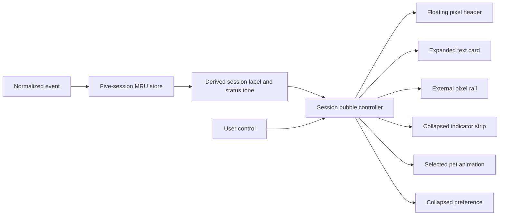

# Session Bubble Controls - Plan

## Goal Capsule

- **Objective:** Redesign the macOS agent-monitor bubble so concurrent active sessions are immediately legible, navigation looks intentionally pixel-native, and the bubble can collapse into a compact status overview without changing monitor semantics.
- **Authority:** The user's confirmed visual and information requirements override this plan. The existing monitor contract in `docs/plans/2026-07-14-001-feat-agent-session-monitor-plan.md` remains authoritative for hooks, provider setup, bounded MRU state, fixed statuses, terminal expiry, and privacy boundaries.
- **Execution profile:** Add the smallest Core presentation metadata needed for deterministic labels and indicator semantics, then implement the AppKit layout and preference wiring. Do not change provider hooks, the loopback envelope, or the pet overlay.
- **Stop conditions:** Stop if a provider's event payload is needed to show a human task title, or if the redesign requires retaining session/event data beyond the current in-memory five-session MRU. Surface that as a scope change instead of weakening the privacy contract.

---

## Product Contract

### Summary

The current bubble shows provider and fixed status, but its visually detached arrow targets are hard to discover and consume the text area. The redesigned bubble keeps one readable session card while making the stack, browsing controls, provider, session label, and current state legible at a glance.

When minimized, it becomes a narrow floating status header with one colored pixel indicator per retained active session. It remains an overlay companion to the pet, not a notification system or an event history.

### Problem Frame

The monitor is useful precisely when the coding tab is not visible. The existing stacked cards show that more sessions exist, but do not make the selection model or controls feel deliberate. A compact mode also needs to preserve attention cues without leaving a full text panel permanently on screen.

### Requirements

**Session navigation and stack**

- R1. Show at most five current monitor sessions in existing MRU order, with the selected entry rendered as the readable card and offset cards still indicating multiplicity.
- R2. Replace the current floating up/down outlines with an always-visible, 8-bit pixel navigation rail attached to the outside-right edge of the expanded card whenever more than one session is retained.
- R3. The rail must include distinct pixel chevrons for previous and next, a selected-position marker, disabled edge states, and enough visible slots to communicate the retained session count before the user clicks.
- R4. Browsing changes only the selected session; it must not reorder the MRU. A new accepted monitor event still moves that session to the front and selects it.

**Expanded bubble**

- R5. Render a floating pixel header directly above the expanded card. The header shows the selected provider on the left and a pixel minimize (`-`) control on the right.
- R6. Render the selected session's stable label and one existing fixed status string inside the text card. Do not add free-form status copy.
- R7. Give every retained session a deterministic, compact, locally derived label such as `SESSION 1A2B3C`. The label distinguishes sessions but must not reveal the raw session identifier, prompt, task title, command, path, or transcript content.

**Collapsed overview**

- R8. Selecting minimize collapses the text card into a floating header that retains the selected provider, session count, a pixel expand (`+`) control, and one traffic-light-style indicator for every retained session.
- R9. Use the following semantic colors: working is yellow, reviewing is cyan, needs approval is violet, finished is green, and failed is red. Color is supplementary; accessible labels and expanded text must identify the same status in words.
- R10. Preserve the collapsed/expanded preference across app relaunches, while monitor sessions themselves remain in-memory only and start empty after relaunch.

**Compatibility, privacy, and lifecycle**

- R11. Leave the monitor's provider selection, hook count and configuration, loopback envelope, fixed event-to-status mapping, five-second terminal expiry, and pet-expression mapping unchanged.
- R12. The collapsed indicator strip updates from the same active-session MRU as the expanded card. When a terminal entry expires, its indicator disappears; when no entries remain, the bubble hides and the pet returns to idle.
- R13. Keep the new pointer controls and VoiceOver descriptions synchronized with a non-color-only representation of selection, state, and disabled navigation.

### Key Flows

- F1. Expanded session update
  - **Trigger:** A selected provider sends a valid normalized event while the bubble is expanded.
  - **Actors:** Hook helper, monitor store, bubble controller, pet overlay.
  - **Steps:** The store replaces or inserts that session, moves it to MRU position one, and selects it. The bubble redraws its header, derived session label, fixed status, stack layers, and external navigation rail. The pet takes the selected status animation.
  - **Outcome:** The most recently active session is readable without creating an event-history entry.

- F2. Browse active sessions
  - **Trigger:** The user selects a pixel chevron in the expanded rail.
  - **Actors:** Bubble controller and monitor store.
  - **Steps:** The controller requests the adjacent clamped selection. The visual marker, header, session label, status, accessibility label, and pet expression update together.
  - **Outcome:** The user can inspect other active sessions without changing their recency order.

- F3. Collapse and resume overview
  - **Trigger:** The user presses `-` in the expanded header or `+` in the collapsed header.
  - **Actors:** Bubble controller, preferences, monitor store.
  - **Steps:** The controller persists the presentation preference and redraws either the expanded card or compact header. In compact mode, every retained session contributes exactly one colored indicator in MRU order.
  - **Outcome:** The monitor stays ambient when minimized and returns to the same selected card when expanded.

### Acceptance Examples

- AE1. With three sessions retained, the expanded panel visibly shows three card layers, a `1/3` position marker, an enabled next control, and two additional rail markers before the user interacts with it.
- AE2. After browsing from the newest Codex session to a Claude session, its header says `CLAUDE`, its card shows the Claude session label and `Needs approval`, and the store's MRU ordering does not change.
- AE3. When the user minimizes a three-session monitor containing working, reviewing, and failed entries, the compact header shows three ordered indicators in yellow, cyan, and red plus a `+` control. The failed indicator disappears after the existing expiry period unless a newer event refreshes that session.
- AE4. A derived session label remains the same across status changes for one `(provider, sessionID)` key and differs from the opaque raw identifier shown nowhere in the UI or bridge payload.
- AE5. With no retained sessions, neither presentation remains on screen and the pet no longer displays a monitor-driven animation.

### Scope Boundaries

**In scope**

- The macOS expanded and collapsed monitor bubble, its visual controls, its accessible descriptions, persisted collapsed preference, safe session label, tests, and monitor documentation.

**Deferred**

- Provider-specific human task titles, prompt snippets, project paths, session search, full history, user-configurable bubble colors, and a settings screen.
- Windows monitor UI, new providers, notifications, or changes to hook installation and IPC transport.

### Dependencies and Assumptions

- The current normalized event continues to provide only provider, opaque session ID, and fixed status. All supported providers already supply an identifier sufficient to keep a stable local session label.
- A short digest-derived label is a session name for identification, not a semantic task title. Human-readable titles require a separate privacy and cross-provider product decision.
- The AppKit companion panel remains nonactivating and is free to change its dimensions as long as its complete layout still clamps beside the pet on every display.

---

## Planning Contract

### Key Technical Decisions

- KTD1. **Use a discrete pixel rail outside the text card.** The control remains visually adjacent to the card but does not consume the card's limited text area. It uses top and bottom pixel chevrons plus up to five stacked markers, which communicate a bounded selection set more clearly than a native continuous scrollbar.
- KTD2. **Keep a separate floating header for presentation controls.** The expanded header reads selected provider plus `-`; the collapsed header reads selected provider, selected/total position, ordered indicators, plus `+`. This keeps controls predictable without mixing them into the session/status text.
- KTD3. **Derive stable anonymous session labels inside the app.** Compute labels from the complete retained key set, formatting a short one-way fingerprint for each key as a pixel-safe `SESSION` label. Start with a compact prefix and extend only colliding labels within the retained set. This satisfies identification without transporting or displaying a task title or raw session ID.
- KTD4. **Make indicator color a semantic presentation token.** Define one Core-level tone per fixed `AgentStatus`, then map that token to AppKit colors in the renderer. Core tests prove the complete mapping; the renderer owns concrete colors and contrast treatment.
- KTD5. **Persist only the collapsed preference.** `UserDefaults` records whether the user prefers compact mode. The session MRU, selected index, labels, and terminal timers remain runtime-only so relaunch cannot revive stale work.
- KTD6. **Keep the existing hook and envelope minimization boundary.** No new payload field is added to `NormalizedAgentEvent` or `AgentMonitorEnvelope`. The new label is computed after the authenticated bridge validates the opaque identity, so no extra hook work, model use, or provider config mutation occurs.
- KTD7. **Expose every custom control semantically.** Draw controls in the pixel renderer but keep real AppKit hit targets. Tooltips, accessibility labels, and enabled state describe direction, selected session position, expanded/collapsed state, and each compact indicator's provider/status pair without requiring the nonactivating panel to take keyboard focus.

### High-Level Technical Design

The bubble controller receives the selected snapshot and all retained entries as it does today. In expanded mode it supplies the header, readable card, stacked layers, and external rail. In collapsed mode it removes the card and rail while retaining a compact header with the aggregate indicator strip and expand control. Both paths are projections of the same MRU state and selection.

### Presentation Contract

| Element | Expanded mode | Collapsed mode | Accessibility contract |
|---|---|---|---|
| Header | Selected provider, selected/total position, `-` | Selected provider, selected/total position, ordered status indicators, `+` | Announces provider, position, mode, and available control. |
| Card | Derived session label and fixed status | Hidden | Announces label and full fixed status when present. |
| Session stack | Offset card layers behind selected card | Hidden | Position count remains in header. |
| Pixel rail | External right-side chevrons and one marker per retained session | Hidden | Chevrons describe destination; selected marker is named by provider and status. |
| Status indicator | Rail marker uses the status tone | One compact light per retained session in MRU order | Announces ordinal, provider, and status; never relies on color alone. |

### Implementation Constraints

- Keep the text treatment bitmap-based. Add only the glyphs required for the safe session-label alphabet and control symbols; do not introduce a font dependency.
- Retain existing AppKit panel behavior, screen selection, and clamp logic. Recalculate the whole bubble frame for both presentation sizes instead of allowing a header or rail to clip independently.
- Preserve the current terminal-expiry scheduling and selection-preservation behavior. A terminal status stays visible only for its existing grace period.
- Do not use raw `sessionID` as a fallback display string, even when deriving the label fails. Use a deterministic safe fallback label instead.

### Risks and Mitigations

| Risk | Impact | Mitigation |
|---|---|---|
| A user expects a task title rather than an anonymous session name | The label may be less descriptive than expected | Document the label's purpose and defer provider-specific titles until they can be collected consistently without exposing content. |
| Color-only compact indicators are ambiguous | A user misses an approval or failure state | Give every indicator an accessible provider/status label, preserve textual status after expansion, and give the selected indicator a pixel outline. |
| The larger control layout clips near a display edge | The overlay becomes distracting or unclickable | Clamp header, card, and rail as one layout group and manually test all supported pet sizes and screen edges. |
| A hash-prefix collision makes two labels look identical | Session browsing becomes ambiguous | Detect collisions among the at-most-five retained entries and extend only the colliding display prefixes. |
| Custom-drawn controls regress interaction affordances | Controls look correct but are not discoverable | Keep AppKit hit targets, tooltips, enabled state, and VoiceOver descriptions synchronized with the drawn state. |

### Alternative Approaches Considered

- **Put arrow controls inside the text card.** Rejected because it leaves too little room for a session name and fixed status, and repeats the present visual-crowding problem.
- **Use a native scrollbar.** Rejected because the MRU is a discrete maximum-of-five selection set, not a continuous document. Pixel markers make both count and status visible.
- **Show provider task titles or initial prompts.** Rejected because current provider adapters intentionally discard that content, support is inconsistent, and it weakens the existing screen-share-safe privacy boundary.
- **Keep the compact indicators but discard selection context.** Rejected because a provider label and selected/total count are needed to reconnect the compact view to the card a user will open.

### Delivery Sequence

1. Add deterministic session-label and status-tone semantics with focused Core tests while preserving the bridge payload.
2. Rebuild the companion panel's expanded layout around the floating header and external pixel rail, then test visual states against controlled snapshots.
3. Add collapsed preference, controls, and AppDelegate wiring; validate expiry and selection transitions in both modes.
4. Update monitor privacy documentation and run the full automated and manual visual matrix.

---

## Implementation Units

### U1. Safe session labels and status-indicator semantics

- **Goal:** Give each current snapshot the deterministic presentation data needed by both bubble modes without widening the normalized event or bridge contract.
- **Requirements:** R6-R7, R9, R11-R12; AE4; KTD3-KTD4, KTD6.
- **Dependencies:** None.
- **Files:**
  - Modify `Sources/PetRunnerCore/AgentMonitor.swift`.
  - Modify `Tests/PetRunnerCoreTests/AgentMonitorTests.swift`.
  - Modify `Tests/PetRunnerCoreTests/AgentMonitorBridgeContractTests.swift`.
- **Approach:** Add a pure label-formatting projection that accepts the retained keys and returns one collision-safe display label per key without exposing `sessionID`. Add a provider-independent status-tone enum/value derived from `AgentStatus`. Keep `NormalizedAgentEvent` and `AgentMonitorEnvelope` structurally unchanged, and add a regression assertion that encoded envelopes still contain only the minimized contract.
- **Test scenarios:**
  - The same key retains one display label across every status update.
  - Different provider/session keys produce distinguishable safe labels, including a controlled prefix-collision case.
  - Every fixed status maps to its intended semantic tone and existing pet animation/text mapping remains unchanged.
  - Serializing and validating the bridge envelope cannot include a display label, prompt, or task content.
- **Verification:** `swift test --filter AgentMonitorTests` and `swift test --filter AgentMonitorBridgeContractTests`.

### U2. Pixel header, readable card, and external navigation rail

- **Goal:** Replace the current arrow treatment with a coherent pixel layout that keeps provider controls, session label, status, stack count, and session navigation legible.
- **Requirements:** R1-R7, R13; F1-F2; AE1-AE2; KTD1-KTD2, KTD7.
- **Dependencies:** U1.
- **Files:**
  - Modify `Sources/PetRunner/SessionBubblePanelController.swift`.
  - Modify `Sources/PetRunner/StackedBubbleBackgroundView.swift`.
  - Modify `Sources/PetRunnerCore/PixelGlyphs.swift`.
  - Modify `Sources/PetRunner/AppDelegate.swift`.
- **Approach:** Render square-cornered pixel frames, pixel chevrons, selected rail markers, disabled states, and header controls in `StackedBubbleBackgroundView`. Retain appropriately sized transparent AppKit controls above the drawn elements for pointer, tooltip, and accessibility behavior. Expand the panel layout only as needed to keep the rail outside the text card, and add bitmap glyphs for the derived session-label alphabet. Wire previous/next and minimized actions through explicit controller callbacks without changing store recency behavior.
- **Test scenarios:**
  - One, two, and five sessions show the correct number of stack layers and rail markers; first/last selection makes only the correct chevron disabled.
  - Browsing changes provider/session/status content and the pet expression but leaves the MRU order unchanged.
  - A new event returns selection to the updated MRU entry and redraws all visual state from that entry.
  - The provider header, session label, status text, rail controls, and VoiceOver labels remain readable at every supported pet size and at display edges.
- **Verification:** Build with `swift test`, then run `./script/build_and_run.sh` and execute the manual expanded-layout matrix in the Verification Contract.

### U3. Collapsed indicator strip and durable presentation preference

- **Goal:** Add a compact, attention-preserving monitor presentation that updates from the same active-session state and restores the user's choice after relaunch.
- **Requirements:** R8-R13; F3; AE3, AE5; KTD2, KTD4-KTD5, KTD7.
- **Dependencies:** U1, U2.
- **Files:**
  - Modify `Sources/PetRunner/Preferences.swift`.
  - Modify `Sources/PetRunner/SessionBubblePanelController.swift`.
  - Modify `Sources/PetRunner/StackedBubbleBackgroundView.swift`.
  - Modify `Sources/PetRunner/AppDelegate.swift`.
- **Approach:** Store a boolean collapsed preference beside the existing monitor preferences. Add the `-` and `+` actions, calculate a smaller panel frame in compact mode, and render exactly one ordered indicator per retained entry. Reuse the same status-tone, selection, expiry, hide, and pet-idle transitions as expanded mode. Keep compact indicators non-history-based and remove them immediately when their associated snapshot is removed.
- **Test scenarios:**
  - Toggling collapse changes only the bubble presentation and persists through a fresh controller/app launch.
  - A mixed-status session set produces one indicator per MRU entry in correct order, semantic color, selection treatment, tooltip, and VoiceOver text.
  - A finished or failed entry disappears from both expanded and compact modes after the existing expiry interval; removing the last entry hides the panel and clears monitor animation.
  - Re-expanding restores the selected session card and its current provider/label/status rather than resetting or reordering state.
- **Verification:** `swift test`; then run `./script/build_and_run.sh` and execute the compact-mode, expiry, relaunch, and accessibility checks in the Verification Contract.

### U4. Monitor documentation and release-quality visual QA

- **Goal:** Make the new session-label privacy contract and interaction model understandable, then verify the shipped monitor UI rather than only its Core state.
- **Requirements:** R7, R9-R13; AE1-AE5; KTD3, KTD6-KTD7.
- **Dependencies:** U1-U3.
- **Files:**
  - Modify `README.md`.
  - Modify `docs/RUN_LOCAL.md`.
  - Modify `docs/solutions/design-patterns/local-agent-monitor-live-state-and-session-history.md` if its current guidance no longer reflects the renderer contract.
- **Approach:** Explain that the monitor shows an anonymized session label and fixed status, that compact lights represent current MRU sessions rather than history, and that the feature still makes no model calls or sends task content. Update the solution only where the final layout alters reusable implementation guidance. Use controlled synthetic events to capture all five statuses and five-session navigation before declaring the UI complete.
- **Test scenarios:**
  - Documentation never implies that monitor labels are task titles or that prompt/path/transcript content is shown.
  - A staged app shows expanded and compact states correctly with multiple providers, terminal expiry, monitor disablement, all supported pet sizes, and multi-display edge placement.
  - Disabled monitoring remains pet-only and does not display a persisted compact header.
- **Verification:** `swift test`, `./script/build_and_run.sh`, and a final diff review confirming that no provider configuration, generated build output, or user monitor data enters the repository.

---

## Verification Contract

| Gate | Command or method | Units | Done signal |
|---|---|---|---|
| Core monitor semantics | `swift test --filter AgentMonitorTests` | U1 | Labels, collision handling, tone mapping, MRU, selection, and terminal removal are deterministic. |
| Bridge privacy regression | `swift test --filter AgentMonitorBridgeContractTests` | U1 | The bridge still accepts only the minimized provider/session/status contract. |
| macOS suite | `swift test` | U1-U3 | Existing Core behavior, provider configuration, and monitor contracts stay green. |
| Staged-app visual QA | `./script/build_and_run.sh` | U2-U4 | The actual companion panel renders and remains correctly placed beside the pet. |
| Documentation and privacy review | Manual diff review of `README.md`, `docs/RUN_LOCAL.md`, and monitor solution | U4 | Copy describes derived session labels and compact status indicators without promising task titles or content visibility. |

### Manual Acceptance Matrix

1. Inject or trigger one session in every status and confirm the expanded header has the provider, the card has a safe session label plus the exact fixed status text, and the status tone is consistent.
2. Create three sessions across Codex, Claude, and Cursor; confirm the newest session is selected, all three layers/markers are visible, and external pixel chevrons visibly enable or disable at the correct ends.
3. Browse from the newest to each older session. Confirm header, label, status, selected rail marker, accessibility label, and pet expression change together while MRU order remains unchanged.
4. Minimize the three-session view. Confirm the compact header retains provider, count, one ordered light per retained session, and `+`; expand again and confirm it restores the same selected card.
5. Trigger `finished` and `failed` in compact and expanded modes. Confirm each stays for the existing grace period, disappears from the stack/indicator strip afterward, and the last removal hides the bubble and returns the pet to idle.
6. Relaunch PetRunner after choosing compact mode. Confirm the mode preference restores but no stale session, indicator, or monitor animation reappears before a new event arrives.
7. Repeat expanded and compact placement at minimum and maximum pet size, at every edge of the primary display, and on a secondary display. Confirm no header, rail, or hit target clips.
8. Use pointer tooltips and VoiceOver to inspect `-`, `+`, both chevrons, selected session position, and every compact indicator. Confirm state remains understandable without color perception.
9. Disable monitoring, relaunch, and confirm pet-only mode shows neither expanded nor compact monitor UI.

---

## Definition of Done

### Global Completion Criteria

- The macOS monitor bubble has a pixel-native external navigation rail, floating provider/control header, readable safe session label, fixed status text, and stacked-session affordance.
- Compact mode persists as a preference and renders one accessible, semantically colored indicator per retained session; it neither stores history nor survives with stale state after relaunch.
- All five statuses use the agreed color semantics, continue to drive the existing pet animation, and remain textually/semantically identifiable without color.
- Monitor provider hooks, configurations, normalized events, bridge envelope, token usage, and terminal-expiry duration remain unchanged.
- Raw session IDs, task names, prompts, commands, paths, tool inputs, and transcripts are neither shown nor newly transported or persisted.
- The relevant automated tests pass, the manual visual matrix passes in the staged app, documentation matches behavior, and no generated output or real user configuration is added to the diff.

### Unit Completion Criteria

- U1 is done when safe labels and status tones are deterministic, collision-safe within the retained set, fully tested, and absent from the IPC envelope.
- U2 is done when expanded bubble controls are pixel-rendered but fully interactive/accessibly named, and browsing preserves MRU ordering.
- U3 is done when collapsed mode persists, represents all current sessions, follows terminal expiry, and reopens the existing selected session without data loss.
- U4 is done when docs accurately state the label/privacy behavior and the complete expanded/compact UI matrix has passed in the staged app.

---

## Appendix

### Sources and Research

- `docs/plans/2026-07-14-001-feat-agent-session-monitor-plan.md` defines the monitor's existing provider, event, bounded-MRU, terminal-lifecycle, and privacy contracts that this plan must preserve.
- `docs/solutions/design-patterns/local-agent-monitor-live-state-and-session-history.md` documents the current event reduction, authenticated local transport, selection preservation, visible stack, terminal removal, and durable-history patterns.
- `Sources/PetRunner/SessionBubblePanelController.swift` and `Sources/PetRunner/StackedBubbleBackgroundView.swift` show the current companion-panel layout, drawn stack, and transparent AppKit navigation targets being replaced.
- `Sources/PetRunnerCore/AgentMonitor.swift` and `Sources/PetRunnerCore/AgentMonitorBridgeContract.swift` show that current monitor data is limited to provider, opaque session identity, and fixed status.
- External research was not needed: this is a narrowly scoped macOS/AppKit presentation redesign with multiple direct local patterns, and the selected approach introduces no third-party dependency or external contract.
