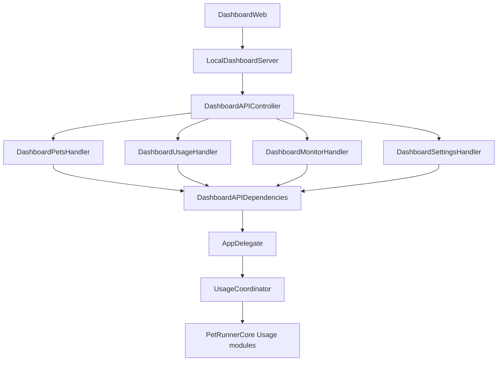
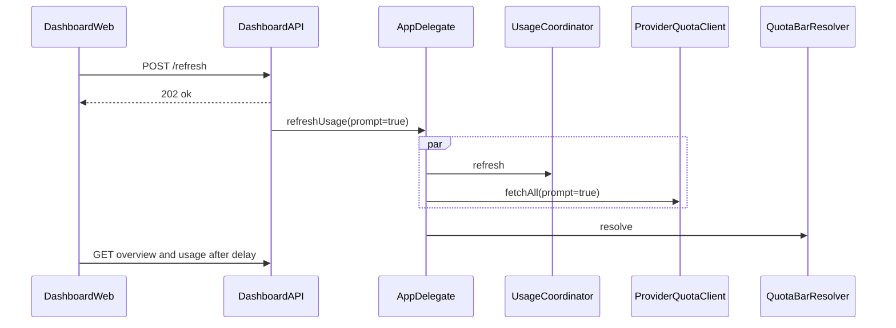

# refactor: Carve Usage and Dashboard API

**Durable path (on execute):** `docs/plans/2026-07-26-001-refactor-usage-dashboard-api-plan.md`

## Summary

Split the macOS Usage domain and Dashboard API god objects into focused modules and resource handlers while freezing HTTP paths, status codes, and JSON shapes. Windows is untouched in this plan (no contract changes). Characterization-first before moves.

## Problem Frame

[`Usage.swift`](Sources/PetRunnerCore/Usage.swift) (~1589 lines) and [`DashboardAPIController.swift`](Sources/PetRunner/DashboardAPIController.swift) (~1193 lines) concentrate parsers, store, pricing, budgets, and all `/api/v2` routes. That slows safe changes and blocks Windows parity work. [`AGENTS.md`](AGENTS.md) already calls for resource splits (`pets` / `usage` / `monitor` / `settings`) without enlarging these files.

## Requirements

- R1. No intentional change to DashboardWeb-visible JSON, HTTP status codes, or route paths (`/api/v2/...`).
- R2. Preserve Keychain intent matrix: only explicit Refresh may pass `allowClaudeKeychainPrompt: true`; launch/timer/pricing/budget/provider paths stay silent (`false`).
- R3. Preserve ledger semantics: full `replace*` on parser-revision / pricing-version bump; incremental upsert on file mtime; Cursor success always replaces.
- R4. Keep `historicalParserRevision` coupled to `BundledPricing.version`.
- R5. Monitor and live-sessions stay separate from Usage spend endpoints (macOS-advanced).
- R6. No Windows Monitor/Cursor/plan-quota port; no Windows file moves unless a contract change is forced (this plan forbids contract changes → Windows out of scope).
- R7. Follow existing Core extraction style (`UsageActivity`, `QuotaBarResolver`, `PetImportService`).

## Scope Boundaries

**In:** macOS Core Usage file carve; macOS Dashboard resource handlers + deps struct; thin AppDelegate wiring; characterization / golden contract tests; `swift test` + `npm run dashboard:test`.

**Out:** AppDelegate full rewrite; moving `PricingCatalogStore` HTTP to host; Windows DashboardServer/Usage.cs restructure; product features; Vite packaging.

**Deferred:** host-layer networking extraction; Windows handler mirror when parity contracts eventually change.

## Key Technical Decisions

| Decision | Choice | Rationale |
|---|---|---|
| KTD1. Platform | macOS-only | Confirmed; Windows contracts unchanged |
| KTD2. Depth | Usage modules + Dashboard handlers together | Both god objects; handlers-only leaves half the debt |
| KTD3. DI shape | `DashboardAPIDependencies` struct of existing closures | Avoid protocol explosion; matches current AppDelegate style |
| KTD4. Router | Thin `DashboardAPIController.response(for:)` dispatches to resource handlers | Keeps `LocalDashboardServer` APIHandler injection stable |
| KTD5. Refresh ownership | Single `onRefreshUsage(Bool)` shared by `/refresh` and `/usage/refresh` | Prevents Keychain gate drift |
| KTD6. Concurrent refresh | Preserve current last-write-wins Tasks | Behavior-preserving; no new serialization |
| KTD7. Usage file map | Models / Aggregators / Budgets / BundledPricing / UsageStore / LocalUsageSource (+ keep `UsageActivity` as-is) | Mirrors existing type blocks; same `PetRunnerCore` module → no import churn |
| KTD8. Tests first | Characterization / golden JSON before file moves | No controller tests today; regressions otherwise land in UI |

## High-Level Technical Design

**Usage Core target layout** (same target, new files):

- `UsageModels.swift` — providers, tokens, costs, records, sessions, queries, aggregates
- `UsageAggregators.swift` — `UsageSessionAggregator`, `CursorSessionGrouping`
- `UsageBudgets.swift` — budget config / policy / alerts
- `BundledPricing.swift` — rates, cost calc, version (drives parser revision)
- `UsageStore.swift` — SQLite ledger
- `LocalUsageSource.swift` — Claude/Codex JSONL scanners + `historicalParserRevision`
- Leave [`UsageActivity.swift`](Sources/PetRunnerCore/UsageActivity.swift) and host [`UsageCoordinator.swift`](Sources/PetRunner/UsageCoordinator.swift) in place

**Dashboard handler layout:**

- `DashboardAPIDependencies.swift` — getters + command closures (including `onRefreshUsage: (Bool) -> Void`)
- `DashboardPetsHandler.swift` / `DashboardUsageHandler.swift` / `DashboardMonitorHandler.swift` / `DashboardSettingsHandler.swift`
- Slim [`DashboardAPIController.swift`](Sources/PetRunner/DashboardAPIController.swift) — route switch only + shared JSON helpers if still shared

## Implementation Units

### U1. Lock contracts with characterization tests

**Goal:** Capture status codes and key JSON fields before any moves.

**Requirements:** R1, R7

**Dependencies:** none

**Files:**
- Create: `Tests/PetRunnerCoreTests/DashboardAPIContractTests.swift` (or host-testable fixtures under Core if pure JSON builders move to testable types)
- Modify: `Tests/PetRunnerCoreTests/UsageTests.swift` only if gaps appear for revision/upsert rules
- Reference: `DashboardWeb/src/data.test.ts`, `DashboardWeb/src/types.ts`

**Approach:** Add focused golden/assertion coverage for overview capabilities matrix, usage totals field names, `409 usage_unavailable` / `409 history_unavailable`, refresh `202` body, and provider-scoped preview limits. Prefer extracting pure JSON builders into testable Core/app helpers only if needed for unit tests without spinning `NWListener`.

**Execution note:** Characterization-first — land failing-or-documenting tests before file splits.

**Test scenarios:**
- Cold load: usage endpoints return `409 usage_unavailable` when snapshot nil
- Happy overview includes expected capability booleans and `apiVersion: 2`
- `POST /refresh` and `POST /usage/refresh` both yield `202` `{ok:true}`
- Provider-scoped usage preview uses larger truncate limit than unscoped
- Live-sessions `409` when history store missing does not affect usage routes
- Existing UsageTests still cover Claude dedupe, Codex deltas, replace-vs-upsert, BundledPricing version overlays

**Verification:** New contract tests pass on current code before any split commits.

### U2. Split Usage.swift into focused Core files

**Goal:** Mechanical move of types into the file map in KTD7 with zero behavior change.

**Requirements:** R3, R4, R7

**Dependencies:** U1

**Files:**
- Modify: `Sources/PetRunnerCore/Usage.swift` (remove moved content or delete if empty)
- Create: `Sources/PetRunnerCore/UsageModels.swift`, `UsageAggregators.swift`, `UsageBudgets.swift`, `BundledPricing.swift`, `UsageStore.swift`, `LocalUsageSource.swift`
- Touch as needed: `Sources/PetRunner/UsageCoordinator.swift` (compile only)
- Tests: `Tests/PetRunnerCoreTests/UsageTests.swift`

**Approach:** Move type blocks intact; keep `public` API names. Ensure `LocalUsageSource.historicalParserRevision` still derives from `BundledPricing.version`. Do not change Windows `Usage.cs`.

**Test scenarios:**
- Parser-revision bump forces full replace (no double-count Claude streams)
- Single-file mtime change upserts only that source
- Pricing overlay / Sonnet5 / catalog cost paths unchanged
- Cursor grouping + store replaceSessions unchanged

**Verification:** `swift test` green; no intentional product diff.

### U3. Introduce DashboardAPIDependencies and resource handlers

**Goal:** Route groups live in separate handlers; controller becomes a thin dispatcher.

**Requirements:** R1, R2, R5

**Dependencies:** U1

**Files:**
- Create: `Sources/PetRunner/DashboardAPIDependencies.swift`, `DashboardPetsHandler.swift`, `DashboardUsageHandler.swift`, `DashboardMonitorHandler.swift`, `DashboardSettingsHandler.swift`
- Modify: `Sources/PetRunner/DashboardAPIController.swift`
- Leave: `Sources/PetRunner/LocalDashboardServer.swift`, `Sources/PetRunnerCore/DashboardHTTP.swift`

**Approach:** Group existing switch arms by resource. Usage handler owns analytics + pricing + refresh aliases. Monitor handler owns `/monitor*` and `/live-sessions*`. Preserve query-default asymmetry (`/usage` → `30d`; activity `all`; etc.). Do not unify refresh into silent paths.

**Test scenarios:**
- Contract tests from U1 still pass
- Refresh routes share one callback; Keychain `true` only on those paths (assert via wiring review + any existing refresh tests)
- Monitor outage does not break usage GETs
- Soft-fail analytics endpoints remain independent

**Verification:** Dashboard API behavior identical under `swift test` + `npm run dashboard:test`.

### U4. Wire AppDelegate and run full verification

**Goal:** Build `DashboardAPIDependencies` once in `configureDashboardServer()`; keep refresh orchestration on AppDelegate.

**Requirements:** R2, R6

**Dependencies:** U2, U3

**Files:**
- Modify: `Sources/PetRunner/AppDelegate.swift` (wiring only)
- Verify unchanged: `windows/PetRunner.Windows/DashboardServer.cs`, `windows/PetRunner.Core/Usage.cs`

**Approach:** Replace long positional closure list with deps struct. Keep `refreshUsage(allowClaudeKeychainPrompt:)` call-site matrix unchanged (dashboard Refresh `true`; launch/timer/pricing/budget/provider `false`).

**Test scenarios:**
- Explicit Refresh may prompt; timer/launch do not (manual or code-path review checklist)
- Pricing refresh `changed=true` still triggers silent `onRefreshUsage(false)`
- PUT budgets persists then silent refresh + quota bar update

**Verification:** `swift test`; `npm run dashboard:test`; `npm pack --dry-run` unchanged allow-list; smoke local dashboard load + Refresh once.

### U5. Document the carve in AGENTS (light)

**Goal:** Mark the follow-up as landed and point to the new file map.

**Requirements:** R7

**Dependencies:** U4

**Files:**
- Modify: `AGENTS.md` (behavioral contracts carve bullet)
- Optional later via `/ce-compound`: `docs/solutions/` pattern note (deferred)

**Test expectation:** none — docs only.

**Verification:** AGENTS no longer says the full carve is only “tracked follow-up”; lists resource handler + Usage module layout.

## Risks

| Risk | Mitigation |
|---|---|
| JSON drift | U1 goldens before moves; DashboardWeb vitest |
| Keychain gate collapse | Single refresh callback; call-site matrix in U4 |
| Parser revision / double-count | Keep revision↔version coupling; UsageTests |
| AppDelegate wiring churn | Deps struct only; no logic move into AppDelegate |
| Accidental Windows scope | Explicit no-touch list |

## Sources & Research

- Repo research: [`Usage.swift`](Sources/PetRunnerCore/Usage.swift), [`DashboardAPIController.swift`](Sources/PetRunner/DashboardAPIController.swift), [`UsageCoordinator.swift`](Sources/PetRunner/UsageCoordinator.swift), [`DashboardWeb/src/api.ts`](DashboardWeb/src/api.ts)
- Learnings: `docs/solutions/design-patterns/quiet-provider-credentials-and-quota-hp-bar.md`, `docs/solutions/design-patterns/local-agent-monitor-live-state-and-session-history.md`
- External research: skipped — strong local extraction patterns already exist
